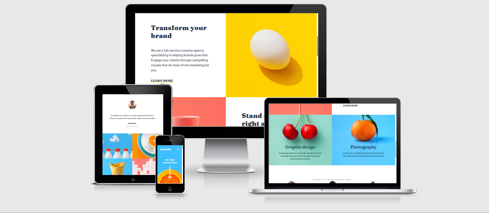
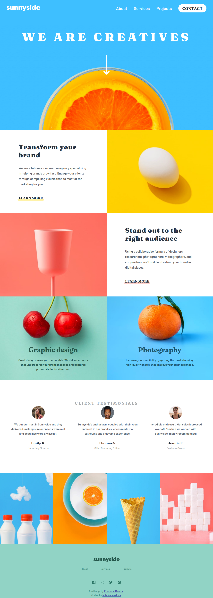

# Frontend Mentor - Sunnyside agency landing page

The project was based on the challenge provided by [Frontend Mentor](https://www.frontendmentor.io).

This is a solution to the [Sunnyside agency landing page challenge on Frontend Mentor](https://www.frontendmentor.io/challenges/sunnyside-agency-landing-page-7yVs3B6ef). 

## The design provided

## Table of contents

- [User Stories](#user-stories)
- [Features](#features)
- [Technologies Used](#technologies-used)
- [Design](#design)
- [Bugs](#bugs)
- [Testing](#testing)
  - [Compatibility](#compatibility)
  - [Validator testing](#validator-testing)
  - [Lighthouse Report](#lighthouse-report)
- [Deployment](#deployment)
- [Author](#author)
- [Credits](#credits)
- [Acknowledgments](#acknowledgments)

I was using design files provided for this challenge in order to make the result look as similar as possible to the provided images.

I have also added various breakpoints in order to provide the best user experience.

The solution to this challenge can be accessed by this [link](https://iuliiakonovalova.github.io/frontend_mentor_sunnyside-agency-landing-page-main/)

---
## User Stories

### First Time Visitor Goals:

* As a First Time Visitor, I want to easily understand the main purpose of the website, so I can learn more about this website.
* As a First Time Visitor, I want to be able to easily navigate through the website, so I can find the content.
* As a First Time Visitor, I want to find the website useful.
* As a First Time Visitor, I want to see the testimonials, so I can see whether the organization is trustworthy.
### Returning Visitor Goals:

* As a Returning Visitor, I want to see various content, so that I can pick the service.
* As a Returning Visitor, I want to find a way to get in contact with the organization, so that I can ask additional questions or send a request about a their service.
* As a Returning Visitor, I want to find community links, so that I can learn more about the organization.
### Frequent Visitor Goals:
* As a Frequent User, I want to be able always access the website, so I can learn about possible changes.
* As a Frequent User, I want to have various content, so I can be engage in visiting this website often.

---
## Features
+ ### Main Page

  - Represent: 

    * the landing page for the sunny agency.
    
    

 - Consist:

     with:

### Navbar
      

The navbar has:

  1. logo in the left top corner

  

  2. Main menu.

  

  for mobile screens menu is hidden and the user may see a hamburger icon to click on to see the whole menu:

  

### Main Section of the header

Which consist main image with the incentive and an arrow.

The arrow has an animated effect to lure the user into clicking the arrow to move to the following content. The smooth-scroll will lead the user to the next section.

### Transformation and Stand out section.

Has distinctive images and content. It also has a link "LEARN MORE" for the users to click on in order to learn more about the company.

### Graphic Design and Photography section.

Has distinctive images on the background and content on them to attract users' attention.

## Testimonials Section

Represents feedback of the previous users to highlight the benefits of the service that the agency provides and facilitate trust in the future clients.
This section has three testimonials fro three different people with their photos, stories, names, and their occupations.

## Gallery Section

Consist 4 high quality photos for the website visitors to see the real work of the company.
When the user hovers over an image, the image zoom in to allow users enjoy the quality and consistency of the agency work.

## Footer Section

This section has a logo at the top, "About", "Services", and "Projects" links, as well as links to the social media of the company to assure users of their service.

## Technologies Used

- [HTML](https://developer.mozilla.org/en-US/docs/Web/HTML) - was used as the foundation of the site.
- [CSS](https://developer.mozilla.org/en-US/docs/Web/css) - was used to add the styles and layout of the site.
- [CSS Flexbox](https://developer.mozilla.org/en-US/docs/Learn/CSS/CSS_layout/Flexbox) - was used to arrange items symmetrically on the pages.
- [CSS Grid](https://developer.mozilla.org/en-US/docs/Web/CSS/grid) - was used to make "gallery" and "contact" pages responsive.
- [CSS roots](https://developer.mozilla.org/en-US/docs/Web/CSS/:root) - was used to declaring global CSS variables and apply them throughout the project. 
- [JS](https://www.javascript.com/) - was used to make calculations and display content on the page.
- [VSCode](https://code.visualstudio.com/) - was used as the main tool to write and edit code.
- [Git](https://git-scm.com/) - was used for the version control of the website.
- [GitHub](https://github.com/) - was used to host the code of the website.
- [GIMP](https://www.gimp.org/) - was used to make and resize images for the README file.

---
## Design

- The color scheme and font-family were provided by [Frontend Mentor](https://www.frontendmentor.io).

- Font-family (**Barlow**) - primary:

- Font-family (**Fraunces**) - Accent:

---
## Bugs
None

---
## Testing
### Compatibility:

+ The app was tested on the following browsers: Chrome, Firefox, Brave, Edge:

  - Chrome:

  
  
  - Firefox:

  

  - Brave:

  

+ The app was checked by devtools implemented on Firefox and Chrome browsers.

### Responsiveness:

+ The app was checked with [Responsive Website Design Tester](https://responsivedesignchecker.com/).

  1. Mobile Screens:

    - Mobile 320x480, 320x568, 360x640, 375x667, 384x640, 411x731, 414x736:

     

      
  1. Tablets Screens:

    - Tablet 600x960, 768x1024, 800x1280, 1366x1024, 1600x900, 1680x1050, 1920x1080, 1920x1200:
        
    
      
  1. Desktop Screens:

    - Desktop 1024x600, 1024x800, 1366x768, 1440x900:
        
    

+ 
+ Functionality:

The functionality of the links in the app was checked as well by different users.

 

---
### Validator testing
+ #### HTML
  
  - No errors or warnings were found when passing through the official [W3C](https://validator.w3.org/) validator.
  
    

+ #### CSS
  
  - No errors or warnings were found when passing through the official [W3C (Jigsaw)](https://jigsaw.w3.org/css-validator/#validate_by_uri) validator except the following warnings regardless root: 

    

    

+ #### JS
  
  - No errors or warnings were found when passing through the official [JSHint](https://jshint.com/) validator except the warnings that   

    

---

### Lighthouse Report

- Issues:

The following issues regarding Accessability were reported due to the designer decisions regarding colors 

---
## Deployment

- The site was deployed to GitHub pages. The steps to deploy are as follows: 
  - In the [GitHub repository](https://github.com/IuliiaKonovalova/frontend_mentor_sunnyside-agency-landing-page-main/), navigate to the Settings tab 
  - From the source section drop-down menu, select the **Main** Branch, then click "Save".
  - The page will be automatically refreshed with a detailed ribbon display to indicate the successful deployment.

The live link can be found [here](https://iuliiakonovalova.github.io/frontend_mentor_sunnyside-agency-landing-page-main/)

---
### Local Deployment

In order to make a local copy of this project, you can clone it.
In your IDE Terminal, type the following command to clone my repository:

- `git clone https://github.com/IuliiaKonovalova/frontend_mentor_sunnyside-agency-landing-page-main.git`

---
## Author

- Website - [Iuliia Konovalova](https://github.com/IuliiaKonovalova)
- Frontend Mentor - [@IuliiaKonovalova](https://www.frontendmentor.io/profile/IuliiaKonovalova)

---
## Credits
+ ### Content and Design

  - [Frontend Mentor](https://www.frontendmentor.io) had provided all necessary content and design that was used in order to complete this challenge.
+ ### Font

  - [Google Fonts](https://fonts.google.com/) was usd in order to implement required font.

---
## Acknowledgement

  - [Frontend Mentor](https://www.frontendmentor.io) for inspiring to improve my skills.
---
## Wireframes

- Desktop:

- Mobile:

- Active:

---

