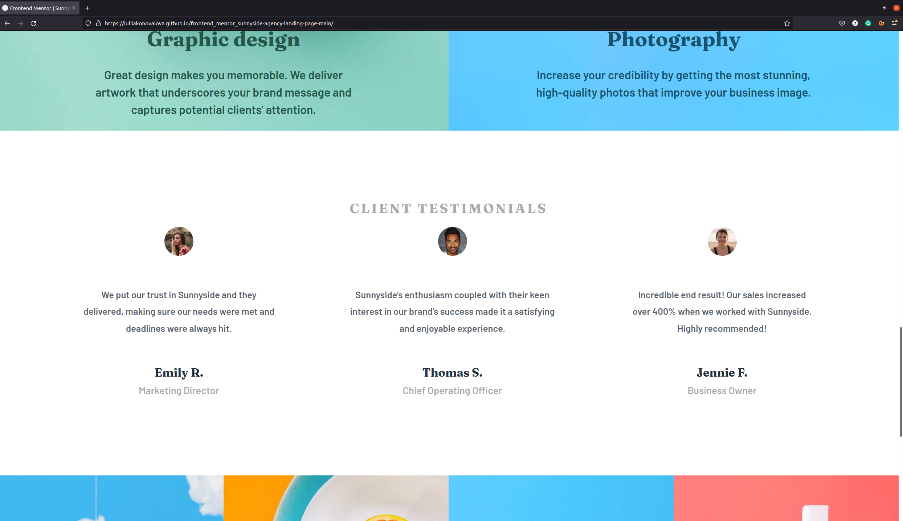
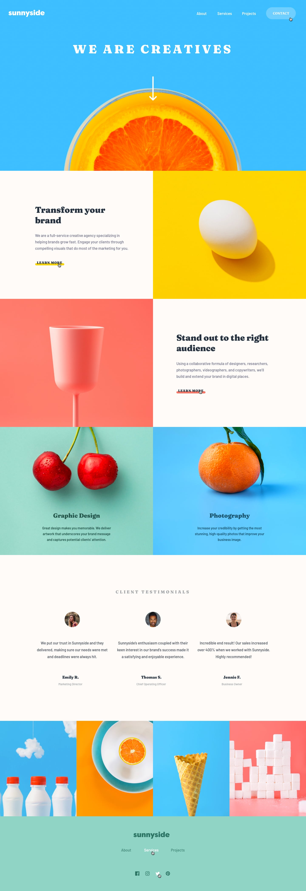

# Frontend Mentor - Sunnyside agency landing page

The project was based on the challenge provided by [Frontend Mentor](https://www.frontendmentor.io).

This is a solution to the [Sunnyside agency landing page challenge on Frontend Mentor](https://www.frontendmentor.io/challenges/sunnyside-agency-landing-page-7yVs3B6ef). 

## The design provided

## Table of contents

- [User Stories](#user-stories)
- [Features](#features)
- [Technologies Used](#technologies-used)
- [Design](#design)
- [Bugs](#bugs)
- [Testing](#testing)
  - [Compatibility](#compatibility)
  - [Validator testing](#validator-testing)
  - [Lighthouse Report](#lighthouse-report)
- [Deployment](#deployment)
- [Author](#author)
- [Credits](#credits)
- [Acknowledgments](#acknowledgments)

I was using design files provided for this challenge in order to make the result look as similar as possible to the provided images.

I have also added various breakpoints in order to provide the best user experience.

The solution to this challenge can be accessed by this [link](https://iuliiakonovalova.github.io/frontend_mentor_sunnyside-agency-landing-page-main/)

---
## User Stories

### First Time Visitor Goals:

* As a First Time Visitor, I want to easily understand the main purpose of the website, so I can learn more about this website.
* As a First Time Visitor, I want to be able to easily navigate through the website, so I can find the content.
* As a First Time Visitor, I want to find the website useful.
* As a First Time Visitor, I want to see the testimonials, so I can see whether the organization is trustworthy.
### Returning Visitor Goals:

* As a Returning Visitor, I want to see various content, so that I can pick the service.
* As a Returning Visitor, I want to find a way to get in contact with the organization, so that I can ask additional questions or send a request about a their service.
* As a Returning Visitor, I want to find community links, so that I can learn more about the organization.
### Frequent Visitor Goals:
* As a Frequent User, I want to be able always access the website, so I can learn about possible changes.
* As a Frequent User, I want to have various content, so I can be engage in visiting this website often.

---

## Technologies Used

- [HTML](https://developer.mozilla.org/en-US/docs/Web/HTML) - was used as the foundation of the site.
- [CSS](https://developer.mozilla.org/en-US/docs/Web/css) - was used to add the styles and layout of the site.
- [CSS Flexbox](https://developer.mozilla.org/en-US/docs/Learn/CSS/CSS_layout/Flexbox) - was used to arrange items symmetrically on the pages.
- [CSS Grid](https://developer.mozilla.org/en-US/docs/Web/CSS/grid) - was used to make "gallery" and "contact" pages responsive.
- [CSS roots](https://developer.mozilla.org/en-US/docs/Web/CSS/:root) - was used to declaring global CSS variables and apply them throughout the project. 
- [JS](https://www.javascript.com/) - was used to make calculations and display content on the page.
- [VSCode](https://code.visualstudio.com/) - was used as the main tool to write and edit code.
- [Git](https://git-scm.com/) - was used for the version control of the website.
- [GitHub](https://github.com/) - was used to host the code of the website.
- [GIMP](https://www.gimp.org/) - was used to make and resize images for the README file.

---

## Bugs
None

---

## Testing
### Compatibility:

+ The app was tested on the following browsers: Chrome, Firefox, Brave, Edge:

  - Chrome:

  
  
  - Firefox:

  

  - Brave:

  

+ The app was checked by devtools implemented on Firefox and Chrome browsers.

### Responsiveness:

+ The app was checked with [Responsive Website Design Tester](https://responsivedesignchecker.com/).

  1. Mobile Screens:

    - Mobile 320x480, 320x568, 360x640, 375x667, 384x640, 411x731, 414x736:

     

      
  1. Tablets Screens:

    - Tablet 600x960, 768x1024, 800x1280, 1366x1024, 1600x900, 1680x1050, 1920x1080, 1920x1200:
        
    
      
  1. Desktop Screens:

    - Desktop 1024x600, 1024x800, 1366x768, 1440x900:
        
    

+ 
+ Functionality:

The functionality of the links in the app was checked as well by different users.

 

---

---
## Author

- Website - [Iuliia Konovalova](https://github.com/IuliiaKonovalova)
- Frontend Mentor - [@IuliiaKonovalova](https://www.frontendmentor.io/profile/IuliiaKonovalova)

---
## Credits
+ ### Content and Design

  - [Frontend Mentor](https://www.frontendmentor.io) had provided all necessary content and design that was used in order to complete this challenge.
+ ### Font

  - [Google Fonts](https://fonts.google.com/) was usd in order to implement required font.

---
## Acknowledgement

  - [Frontend Mentor](https://www.frontendmentor.io) for inspiring to improve my skills.
---
## Wireframes

- Desktop:

- Mobile:

- Active:

---

